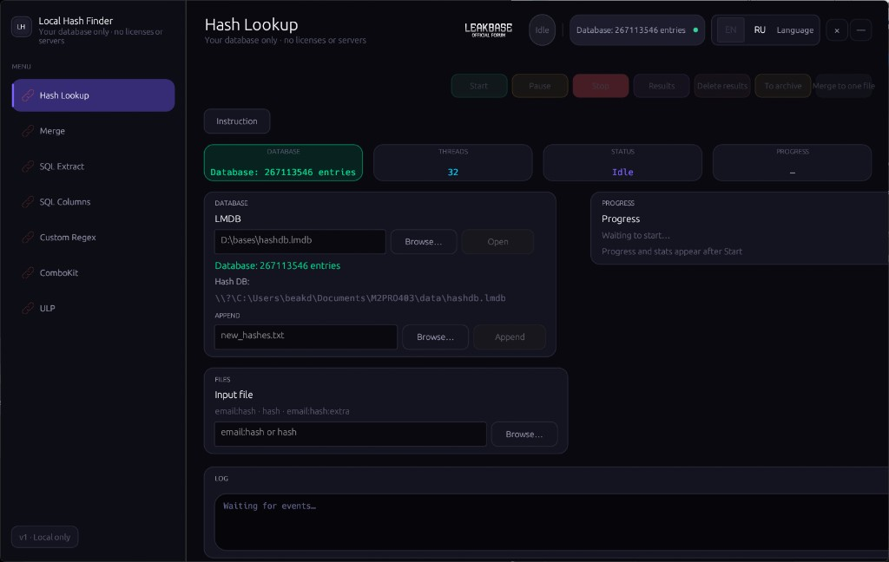
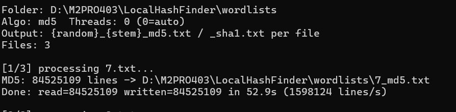
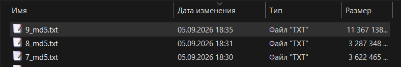

[](https://leakbase.su)

# HashFinder / HashPars / Reg /CleanRows

**Офлайн desktop-набор для расшифровки хешей, обработки combo-листов и ULP-инструментов.**

> Local Hash Finder — портативное Windows-приложение на Rust. Все операции выполняются локально: без облака, без лицензий и без отправки данных на сервер. Вы сами выбираете LMDB-базу хешей и свои входные файлы.

---

# **✳️ Содержание**

 1. [Возможности](#%D0%B2%D0%BE%D0%B7%D0%BC%D0%BE%D0%B6%D0%BD%D0%BE%D1%81%D1%82%D0%B8)
 2. [Интерфейс](#%D0%B8%D0%BD%D1%82%D0%B5%D1%80%D1%84%D0%B5%D0%B9%D1%81)
 3. [Требования](#%D1%82%D1%80%D0%B5%D0%B1%D0%BE%D0%B2%D0%B0%D0%BD%D0%B8%D1%8F)
 4. [Быстрый старт](#%D0%B1%D1%8B%D1%81%D1%82%D1%80%D1%8B%D0%B9-%D1%81%D1%82%D0%B0%D1%80%D1%82)
 5. [Источники wordlist (plaintext)](#%D0%B8%D1%81%D1%82%D0%BE%D1%87%D0%BD%D0%B8%D0%BA%D0%B8-wordlist-plaintext)
 6. [База данных LMDB](#%D0%B1%D0%B0%D0%B7%D0%B0-%D0%B4%D0%B0%D0%BD%D0%BD%D1%8B%D1%85-lmdb)
 7. [Сборка базы с нуля](#%D1%81%D0%B1%D0%BE%D1%80%D0%BA%D0%B0-%D0%B1%D0%B0%D0%B7%D1%8B-%D1%81-%D0%BD%D1%83%D0%BB%D1%8F)
 8. [Конфигурация](#%D0%BA%D0%BE%D0%BD%D1%84%D0%B8%D0%B3%D1%83%D1%80%D0%B0%D1%86%D0%B8%D1%8F)
 9. [CLI и bat-скрипты](#cli-%D0%B8-bat-%D1%81%D0%BA%D1%80%D0%B8%D0%BF%D1%82%D1%8B)
10. [SCRIPTS.md — полный справочник bat-скриптов](SCRIPTS.md)
11. [Структура проекта](#%D1%81%D1%82%D1%80%D1%83%D0%BA%D1%82%D1%83%D1%80%D0%B0-%D0%BF%D1%80%D0%BE%D0%B5%D0%BA%D1%82%D0%B0)
12. [Технологии](#%D1%82%D0%B5%D1%85%D0%BD%D0%BE%D0%BB%D0%BE%D0%B3%D0%B8%D0%B8)
13. [Скриншоты](#%D1%81%D0%BA%D1%80%D0%B8%D0%BD%D1%88%D0%BE%D1%82%D1%8B)
14. [Сообщить об ошибке](#%D1%81%D0%BE%D0%BE%D0%B1%D1%89%D0%B8%D1%82%D1%8C-%D0%BE%D0%B1-%D0%BE%D1%88%D0%B8%D0%B1%D0%BA%D0%B5)
15. [Отказ от ответственности](#%D0%BE%D1%82%D0%BA%D0%B0%D0%B7-%D0%BE%D1%82-%D0%BE%D1%82%D0%B2%D0%B5%D1%82%D1%81%D1%82%D0%B2%D0%B5%D0%BD%D0%BD%D0%BE%D1%81%D1%82%D0%B8)
16. [Лицензия](#%D0%BB%D0%B8%D1%86%D0%B5%D0%BD%D0%B7%D0%B8%D1%8F)
17. [Hashcat и LocalHashFinder](#hashcat-%D0%B8-localhashfinder)
18. [English](#english)

---

<details>
<summary>✳️Возможности</summary>


Приложение состоит из **7 модулей** (вкладок в боковой панели):

<details>
<summary>1. Hash Lookup</summary>

Пакетный поиск паролей по MD5/SHA1 в локальной LMDB-базе.

```
Открытие и выбор пути к hashdb.lmdb
Пакетная обработка файлов (email:hash, hash, email:hash:extra)
Настраиваемое число потоков (до 512)
Выход: {name}_good.txt, {name}_nohash.txt, {name}_bad.txt, {name}_trash.txt
Import — первичная загрузка hash:pass в LMDB (CLI / IMPORT-DB.bat)
Append — дополнение существующей базы без перезаписи дубликатов (GUI / APPEND-DB.bat)
Пауза, стоп, просмотр результатов в проводнике
```

</details>

<details>
<summary>2. Merge</summary>

> Объединение `mail:hashedpass` и `hash:plainpass` → `mail:plainpass`.

```
Вход: список email:hash + файл расшифровки (_good.txt или hash:pass)
Выход: {stem}_plain.txt, {stem}_plain_nohash.txt, {stem}_trash.txt
CLI: merge --mail … --dehash … / MERGE.bat
```

</details>

<details>
<summary>3. SQL Extract</summary>

> Извлечение `email:md5` / `email:sha1` из SQL-дампов через regex.

```
Один файл или папка (.sql, .txt, .dump)
Параллельная обработка (до 5 потоков)
UTF-8 и Windows-1252, поддержка BOM
Выход: {stem}_emails.txt, {stem}_trash.txt
CLI: extract-sql / EXTRACT-SQL.bat
```

</details>

<details>
<summary>4. SQL Columns</summary>

> Извлечение `login:password` по именам колонок в `CREATE TABLE` / `INSERT`.

```
Распознавание колонок login/email/user и password/pass/pwd
Несколько кортежей в одной строке INSERT
Пакетная обработка папки с дампами
Выход: {stem}_loginpass.txt
CLI: extract-sql-columns
```

</details>

<details>
<summary>5. Custom Regex</summary>

> Произвольное извлечение по regex с шаблоном вывода (`$1`, `$2`, `${name}`).

```
Пресеты: email:md5, email:sha1, hash:pass, email only
Флаги: case-insensitive, multiline, dotall, dedupe
CLI: extract-regex --pattern … --template …
```

</details>

<details>
<summary>6. ComboKit</summary>

```
11 инструментов для combo-листов (без LMDB):
```

| Инструмент | Описание |
| --- | --- |
| **Compare** | Сравнение двух списков → `only_a`, `only_b`, `both` |
| **Combo filter** | Валидация `email:pass`, отсев мусора |
| **Email filter** | Только строки с email |
| **Split name/password** | Разделение на `names.txt` + `passwords.txt` |
| **MX check** | Проверка MX-записей доменов |
| **Scraper** | Извлечение combo из `.txt` / `.sql` / `.json` |
| **Analyze** | Группировка по доменам (`by_domain/`) |
| **Dedupe** | Уникальные строки |
| **Line filter** | Фильтр по подстроке или regex |
| **Merge** | Склейка строк в один файл |
| **Split** | Разбиение файла по N строк |

</details>

<details>
<summary>7. ULP</summary>

18 сервисов для обработки `url:login:pass` (архивы `.zip` / `.7z` / `.rar` и папки):

| Сервис | Описание |
| --- | --- |
| **Sort** | Сортировка по типам (Mails, Mail Pass, Phone Pass, User Pass, ULP) |
| **Sort Country** | Сортировка по TLD → `by_tld/`, `by_domain/` |
| **Sort Keyword** | Разложение по keyword в отдельные файлы |
| **Search** | Поиск по keyword → один файл |
| **Extract url:login:pass** | Извлечение полного ULP |
| **Extract login:pass** | Извлечение `login:pass` |
| **Extract user:pass** | Извлечение `user:pass` |
| **Clean — dedupe** | Удаление дубликатов строк |
| **Clean — empty lines** | Удаление пустых строк |
| **Clean — junk** | Удаление junk-символов |
| **Clean — blacklist** | Фильтр blacklist-доменов |
| **Clean — empty chars** | Удаление пустых символов |
| **Clean — weak** | Отсев слабых паролей |
| **Clean — protocols** | Удаление протоколов (`http://`, …) |
| **Clean — capture** | Обработка capture-строк |
| **Misc — merge** | Склейка файлов |
| **Misc — split** | Split по числу строк |
| **Misc — filter** | Фильтр по keyword |

</details>

</details>

---


<details>
<summary>Интерфейс</summary>


```
Crypto dashboard — тёмная тема в стиле RecehTok (фиолетовый акцент, stat-tiles, нижняя панель управления)
RU / EN — переключение языка в шапке, строки в engine/src/i18n.rs
Frameless window — окно без системной рамки, собственные кнопки свернуть / закрыть, скруглённые углы (DWM на Windows)
Вкладки: Расшифровка · Склейка · SQL Extract · SQL Колонки · Custom Regex · ComboKit · ULP
Лог, результаты, инструкции на каждой вкладке
```

</details>

---


<details>
<summary>Требования</summary>


```
Windows 10 / 11 (основная платформа; сборка заточена под Windows)
Для сборки из исходников: Rust (stable), cargo
Достаточно места на диске под LMDB (для больших баз — сотни GB map size)
```

</details>

---


<details>
<summary>Быстрый старт</summary>


```bat
BUILD.bat
START-LOCAL-HASH.bat
```

1. `BUILD.bat` — `cargo build --release` в `engine/`, копирует `LocalHashFinder.exe` в `engine/target/release/`
2. `START-LOCAL-HASH.bat` — создаёт `data/` и `LocalHashFinder.cfg` при первом запуске, открывает GUI

Исполняемый файл: `engine/target/release/LocalHashFinder.exe`

</details>

---


<details>
<summary>Источники wordlist (plaintext)</summary>


Публичные ресурсы для **plain-password** списков (используйте только в рамках закона и для своих систем):

**Каталоги и сайты**

| Ресурс | Описание |
| --- | --- |
| [HashMob](https://hashmob.net/) | База и сообщество по hash lookup; wordlist-ы и материалы для исследований |
| [Weakpass](https://weakpass.com/wordlist) | Большие публичные wordlist-ы (часть бесплатна) |
| [g0tmi1k — wordlists](https://download.g0tmi1k.com/wordlists) | Каталог wordlist-ов для pentest и аудита |
| [SecLists — Passwords](https://github.com/danielmiessler/SecLists/tree/master/Passwords) | Классика: `rockyou.txt`, `10k-most-common.txt`, `best1050.txt` |

**Крупные plaintext-дампы (Mail.ru Cloud, .txt)**

| Ссылка | Размер |
| --- | --- |
| [260M passwords](https://cloud.mail.ru/public/HsHb/JamxkSKRF) | \~260 млн |
| [243M passwords](https://cloud.mail.ru/public/hEUf/XJkHjc6Ny) | \~243 млн |
| [358M passwords](https://cloud.mail.ru/public/EnHr/Qx1hYDDrC) | \~358 млн |
| [112M passwords](https://cloud.mail.ru/public/K6Ho/HCcQFxHNH) | \~112 млн |
| [950M passwords](https://cloud.mail.ru/public/eo1N/SYYp5gELP) | \~950 млн |
| [999M+ passwords](https://cloud.mail.ru/public/Coni/QgPayRbhv) | 999+ млн |

Для файлов на сотни миллионов строк закладывайте место на диске; перед хешированием прогоните через `MERGE-CLEAN.bat`.

**Цепочка в LocalHashFinder:**

```
скачать .txt → MERGE-CLEAN.bat (только пароли) → WORDLIST-HASH-FOLDER.bat → IMPORT-DB.bat
```

</details>

---


<details>
<summary>База данных LMDB</summary>


> **Готовая база в GitHub Releases пока не выложена** — файл `hashdb.lmdb` в репозиторий не входит. Сейчас базу нужно **собрать локально**: wordlist → `MERGE-CLEAN.bat` → `WORDLIST-HASH-FOLDER.bat` → `IMPORT-DB.bat` (см. [источники wordlist](#%D0%B8%D1%81%D1%82%D0%BE%D1%87%D0%BD%D0%B8%D0%BA%D0%B8-wordlist-plaintext)). Релиз с предсобранной LMDB появится позже.

Путь по умолчанию: `engine/target/release/data/hashdb.lmdb`

| Действие | Способ |
| --- | --- |
| Первичный импорт | `IMPORT-DB.bat "D:\path\to\hash_pass.txt" [map_gb]` |
| Дополнение базы | `APPEND-DB.bat "D:\new_hashes.txt" [map_gb]` или вкладка «Расшифровка» → Append |
| Формат строки | `hash:password` (32 или 40 hex-символов) |

Подготовка wordlist → `hash:pass` (по умолчанию MD5): `WORDLIST-HASH.bat "passwords.txt"` (один файл) или `WORDLIST-HASH-FOLDER.bat "D:\wordlists"` (все `*.txt` в папке, по умолчанию `wordlists\`). Выходной файл: `{random}_{имя}_md5.txt` (например `847291_passwords_md5.txt`). Опционально: второй аргумент `sha1` или `both`.

`map_gb` — размер map LMDB в GB (по умолчанию 280; для \~200 GB исходника). Импорт больших файлов может занять много часов — не закрывайте окно.

Перед import/append **закройте** GUI (LMDB не поддерживает одновременную запись из двух процессов).

</details>

---


<details>
<summary>Сборка базы с нуля</summary>


Пошаговая инструкция: как самим собрать и пополнять `hashdb.lmdb`. Подробности по каждому `.bat` — в [SCRIPTS.md](SCRIPTS.md).

### Что нужно

|  |  |
| --- | --- |
| **ОС** | Windows 10 / 11 |
| **Сборка** | `BUILD.bat` (Rust stable) |
| **Диск** | Место под raw wordlist + clean + `*_md5.txt` + LMDB (для сотен млн строк — десятки–сотни GB) |
| **Время** | Import больших файлов — часы и больше |

### Два сценария

| Сценарий | Вход | Что делать |
| --- | --- | --- |
| **A — с wordlist** | `.txt` с plain-password (один пароль на строку) | Шаги 1–5 ниже |
| **B — уже есть hash:pass** | Файл `32hex:pass` или `40hex:pass` | Сразу `IMPORT-DB.bat` (шаг 4), без MERGE/WORDLIST-HASH |

### Шаг 1. Скачать wordlist-ы

Нужны **plaintext**-списки (без `login:pass`). Источники — в разделе [Источники wordlist](#%D0%B8%D1%81%D1%82%D0%BE%D1%87%D0%BD%D0%B8%D0%BA%D0%B8-wordlist-plaintext): SecLists (`rockyou.txt` — хороший старт), Weakpass, g0tmi1k, HashMob, дампы Mail.ru.

Сложите файлы, например, в `D:\wordlists\raw\`. Используйте только законно и для своих систем.

### Шаг 2. Очистка → только пароли

```bat
MERGE-CLEAN.bat "D:\wordlists\raw" "D:\wordlists\merged_clean.txt" recursive
```

Оставляет plain passwords; удаляет строки с `:`, hash:pass, email:pass, чистый hex, строки короче 3 символов.

### Шаг 3. Пароли → MD5 hash:pass

Папка с `.txt`:

```bat
WORDLIST-HASH-FOLDER.bat "D:\wordlists" md5 32
```

Один файл:

```bat
WORDLIST-HASH.bat "D:\wordlists\merged_clean.txt"
```

На выходе: `{random}_{имя}_md5.txt`, формат `hash:password`. Обработка потоковая (без OOM).

### Шаг 4. Импорт в LMDB

**GUI должен быть закрыт.**

```bat
IMPORT-DB.bat "D:\wordlists\847291_merged_clean_md5.txt" 4
```

| Аргумент | Описание |
| --- | --- |
| 1-й | Путь к `hash:pass` |
| 2-й | `map_gb` — размер map LMDB (малый тест: `4`; сотни GB данных: `280`+) |

Результат: `engine\target\release\data\hashdb.lmdb`

### Шаг 5. Расшифровка

```bat
START-LOCAL-HASH.bat
```

Вкладка **«Расшифровка»** → файл `email:hash` / `hash` → **Старт**.

### Пополнение базы (append)

Новый `hash:pass` → **закрыть GUI** →:

```bat
APPEND-DB.bat "D:\new_hashes.txt" 280
```

Или **Расшифровка** → Append в GUI (без параллельного import из bat).

### Схема

```
скачать .txt → MERGE-CLEAN.bat → WORDLIST-HASH-FOLDER.bat → IMPORT-DB.bat → START-LOCAL-HASH.bat
                                                              ↑
                    пополнение: APPEND-DB.bat (новый hash:pass)
```

### Быстрый тест (rockyou)

```bat
BUILD.bat
REM скачать rockyou.txt в wordlists\
MERGE-CLEAN.bat "wordlists" "wordlists\clean.txt"
WORDLIST-HASH.bat "wordlists\clean.txt"
IMPORT-DB.bat "wordlists\*_md5.txt" 4
START-LOCAL-HASH.bat
```

### Заметки

- **Combo** (`email:hash`) в базу не импортируют — их **lookup**-ят по уже собранной LMDB.
- **SQL-дампы** → `EXTRACT-SQL.bat` → lookup, не wordlist-пайплайн.
- Если import падает по map size — увеличьте `map_gb`.
- На каждом этапе нужно место на диске под промежуточные файлы.

</details>

---


<details>
<summary>Конфигурация</summary>


Файл рядом с exe: `LocalHashFinder.cfg`

```ini
# LocalHashFinder — settings
lmdb_path=C:\...\engine\target\release\data\hashdb.lmdb
ui_lang=ru
ui_zoom=1.10
```

- `lmdb_path` — каталог LMDB
- `ui_lang` — `ru` или `en`
- `ui_zoom` — фиксированный масштаб UI (1.10)

Файл создаётся автоматически при первом запуске через `START-LOCAL-HASH.bat`.

</details>

---


<details>
<summary>CLI и bat-скрипты</summary>


> **Полная документация:** [SCRIPTS.md](SCRIPTS.md) — назначение, параметры, примеры и цепочки workflow для каждого `.bat`.

| Скрипт | Команда |
| --- | --- |
| `BUILD.bat` | Сборка release |
| `START-LOCAL-HASH.bat` | Запуск GUI |
| `START-WEB.bat` | Legacy web UI (Node.js, `server.js`) |
| `WORDLIST-HASH.bat` | plaintext wordlist → `hash:pass` MD5 (один файл, выход `{random}_{stem}_md5.txt`) |
| `WORDLIST-HASH-FOLDER.bat` | то же для всех `*.txt` в папке (MD5 по умолчанию; пропуск hash-выходов) |
| `IMPORT-DB.bat` | `import` в LMDB |
| `APPEND-DB.bat` | `append` в LMDB |
| `MERGE.bat` | `merge --mail … --dehash …` |
| `EXTRACT-SQL.bat` | `extract-sql` |
| `MERGE-CLEAN.bat` | `TextMerger merge` — склейка wordlist `.txt`, чистка мусора, dedupe |

### TextMerger — склейка словарей паролей

Отдельная утилита `TextMerger.exe` для объединения `.txt` wordlist-ов в один файл: **только plain-пароли**, по одному на строку, с dedupe.

**Удаляется (мусор):**

- строки с `:NULL` (регистронезависимо)
- строки короче 3 символов после trim (`--min-len 3`)
- пустые строки, комментарии (`#`, `;`)
- **hash-строки:** чистый MD5/SHA1 hex (32/40 символов), `hash:pass`, `email:hash`
- **combo-строки:** любая строка с символом `:` (`login:pass`, `email:pass`, `domain:pass`)
- строки только из спецсимволов

**Сохраняется:** только plain passwords без `:` — `password123`, `qwerty`, `MyP@ss!2024`.

**Dedupe:** hash-partition (256 buckets) + in-memory set на bucket — без OOM на GB-файлах.

```bat
MERGE-CLEAN.bat "D:\wordlists" "D:\merged_clean.txt"
MERGE-CLEAN.bat "D:\wordlists" "merged.txt" recursive

engine\target\release\TextMerger.exe merge --input wordlists --output merged.txt --recursive --min-len 3 --threads 32
```

Статистика: `empty_trash`, `short_trash`, `null_trash`, `hash_trash`, `combo_trash`, `duplicates`.

Примеры:

```bat
engine\target\release\LocalHashFinder.exe --db data lookup 5f4dcc3b5aa765d61d8327deb882cf99
engine\target\release\LocalHashFinder.exe process input.txt --threads 64
engine\target\release\LocalHashFinder.exe extract-regex dump.sql --pattern "..." --template "$1:$2"
```

Полный список подкоманд: `LocalHashFinder.exe --help`

</details>

---


<details>
<summary>Структура проекта</summary>


```
LocalHashFinder/
├── BUILD.bat
├── START-LOCAL-HASH.bat
├── START-WEB.bat
├── IMPORT-DB.bat
├── APPEND-DB.bat
├── WORDLIST-HASH.bat
├── WORDLIST-HASH-FOLDER.bat
├── MERGE.bat
├── MERGE-CLEAN.bat
├── EXTRACT-SQL.bat
├── SCRIPTS.md
├── LICENSE
├── CONTRIBUTING.md
├── README.md
├── .gitignore
├── .github/workflows/rust.yml
├── design/
│   ├── figma-reference.html
│   ├── figma-reference-lookup.html
│   └── assets-b64.txt          # dev-артефакт (в .gitignore)
└── engine/
    ├── Cargo.toml
    ├── assets/                   # иконки UI
    └── src/
        ├── main.rs               # CLI + точка входа GUI
        ├── app.rs                # egui UI, 7 вкладок
        ├── db.rs                 # LMDB import/append/lookup
        ├── processor.rs          # пакетная расшифровка
        ├── merger.rs             # склейка mail+dehash
        ├── sql_extract.rs        # SQL regex extract
        ├── sql_columns.rs        # SQL column extract
        ├── regex_extract.rs      # custom regex
        ├── config.rs             # LocalHashFinder.cfg
        ├── i18n.rs               # RU/EN строки
        ├── combo/                # ComboKit (11 tools)
        └── ulp/                  # SwiftyULP (18 services)
```

</details>

---


<details>
<summary>Технологии</summary>


| Компонент | Стек |
| --- | --- |
| Язык | Rust 2021 |
| GUI | [egui](https://github.com/emilk/egui) / [eframe](https://github.com/emilk/egui/tree/master/crates/eframe) |
| База хешей | [LMDB](https://www.symas.com/lmdb) через [heed](https://github.com/meilisearch/heed) |
| Параллелизм | [rayon](https://github.com/rayon-rs/rayon) |
| Архивы ULP | [zip](https://docs.rs/zip), [sevenz-rust](https://docs.rs/sevenz-rust) |
| CLI | [clap](https://docs.rs/clap) |
| Regex | [regex](https://docs.rs/regex) |

</details>

---


<details>
<summary>Скриншоты</summary>




**Wordlist → MD5 (бенчмарк):** ~84,5 млн строк за **52,9 с** (~1,6 млн строк/с) на слабом ПК — `WORDLIST-HASH-FOLDER.bat`, авточисло потоков.



**Пакет из 3 wordlist → MD5:** ~**266 млн** строк за **~4 мин** (~1,1 млн строк/с) — по **времени изменения** файлов `7_md5.txt` … `9_md5.txt` в проводнике (18:30 → 18:35), слабый ПК.



| Описание | Путь |
| --- | --- |
| Скриншот приложения | `docs/screenshot-main.png` |
| Бенчмарк wordlist → MD5 (1 файл) | `docs/benchmark-wordlist-md5.png` |
| Бенчмарк wordlist → MD5 (пакет) | `docs/benchmark-wordlist-md5-batch.png` |
| Общий вид UI (макет) | `design/figma-reference.html` |
| Вкладка «Расшифровка» (макет) | `design/figma-reference-lookup.html` |

Откройте HTML-файлы в браузере для просмотра дизайн-референса.

</details>

---


<details>
<summary>Сообщить об ошибке</summary>


Если что-то **не работает** или появляется ошибка:

1. Откройте [GitHub Issues](https://github.com/beakdaz/LocalHashFinder/issues/new/choose) → **Bug Report**
2. Укажите шаги, вкладку/скрипт и **текст ошибки** (можно `LHF_ERR:...`)
3. **Не прикладывайте** реальные combo, пароли или wordlist-ы

Сообщения разбираются и исправления выкладываются в `main`.

</details>

---


<details>
<summary>Отказ от ответственности</summary>


Local Hash Finder — **офлайн-инструмент** для работы с **вашими собственными данными** на вашем компьютере.

- Приложение **не подключается** к серверам для расшифровки или хранения данных
- Разработчики **не предоставляют** базы паролей и не поощряют несанкционированный доступ
- Вы несёте ответственность за соблюдение законодательства и правил использования данных
- Не публикуйте в Issues реальные дампы, combo-листы или персональные данные

</details>

---


<details>
<summary>Лицензия</summary>


[MIT License](LICENSE) — Copyright (c) 2026 LocalHashFinder contributors

</details>

---


<details>
<summary>Hashcat и LocalHashFinder</summary>


**LocalHashFinder** и **[Hashcat](https://hashcat.net/hashcat/)** решают разные задачи; вместе они сильнее, чем по отдельности.

| | LocalHashFinder | Hashcat |
| --- | --- | --- |
| Суть | lookup по своей LMDB (`hash:pass`) | crack / перебор кандидатов |
| Алгоритмы | **только MD5 и SHA1** | сотни режимов (bcrypt, NTLM, WPA…) |
| Железо | CPU, много потоков | **GPU** — главное преимущество |
| Сильная сторона | свой огромный офлайн-пак + пакетный combo/SQL/ULP | **rules, masks, hybrid** — уникальные good, которых нет в публичных дампах |

**Почему rules в Hashcat дают «уникальные» good:** словарь + правила (`-r best64.rule`, свои `.rule`) и маски генерируют варианты (`Password1!`, `p@ssw0rd2024`), которых **нет ни в одном leak-базе**. LocalHashFinder ищет только то, что уже лежит в вашей LMDB — новые plaintext он не «выдумает».

**Типичная связка:**

```
Hashcat (rules / mask / GPU)  →  hash:pass / potfile
        ↓
IMPORT-DB.bat / APPEND-DB.bat  →  hashdb.lmdb
        ↓
LocalHashFinder lookup  →  batch combo, merge, GUI
```

На мощном CPU (и в перспективе GPU для wordlist-hash) можно собрать **свой большой MD5/SHA1-пак** и дальше гонять combo быстрее и удобнее, чем каждый раз поднимать Hashcat — но **только для MD5/SHA1** и только для **уже известных** пар hash:pass.

**Hashcat законен?** Да — это легальный open-source инструмент для аудита и восстановления паролей. Как и LocalHashFinder: **законен сам инструмент**, ответственность за **законность использования** на вас — только свои системы, свои дампы или явное разрешение владельца. Чужие базы и аккаунты без санкции — незаконны.

</details>

---

# English

**Offline desktop toolkit for hash lookup, combo processing, and ULP tools.**

Local Hash Finder is a portable Windows application written in Rust. All processing runs locally — no cloud, no license server, no data upload. You provide your own LMDB hash database and input files.

---

<details>
<summary>Table of contents (EN)</summary>


- [Features](#features)
- [User interface](#user-interface)
- [Requirements](#requirements)
- [Quick start](#quick-start)
- [Wordlist sources (plaintext)](#wordlist-sources-plaintext)
- [LMDB database](#lmdb-database)
- [Building the database from scratch](#building-the-database-from-scratch)
- [Configuration](#configuration)
- [CLI and batch scripts](#cli-and-batch-scripts)
- [SCRIPTS.md — full batch script reference](SCRIPTS.md)
- [Project structure](#project-structure)
- [Tech stack](#tech-stack)
- [Screenshots](#screenshots-en)
- [Report a bug](#report-a-bug)
- [Disclaimer](#disclaimer)
- [License](#license-en)
- [Hashcat and LocalHashFinder](#hashcat-and-localhashfinder)

</details>

---


<details>
<summary>Features</summary>


Seven sidebar modules:

<details>
<summary>1. Hash Lookup</summary>

Batch password lookup for MD5/SHA1 against a local LMDB database.

- Open/select `hashdb.lmdb` path
- Batch file processing (`email:hash`, `hash`, `email:hash:extra`)
- Configurable thread count (up to 512)
- Outputs: `{name}_good.txt`, `{name}_nohash.txt`, `{name}_bad.txt`, `{name}_trash.txt`
- **Import** — initial `hash:pass` load (`IMPORT-DB.bat` / CLI)
- **Append** — add entries, skip duplicate keys (`APPEND-DB.bat` / GUI)
- Pause, stop, open results in Explorer

</details>

<details>
<summary>2. Merge</summary>

Combine `mail:hashedpass` + `hash:plainpass` → `mail:plainpass`.

- Outputs: `{stem}_plain.txt`, `{stem}_plain_nohash.txt`, `{stem}_trash.txt`
- CLI: `merge --mail … --dehash …` / `MERGE.bat`

</details>

<details>
<summary>3. SQL Extract</summary>

Extract `email:md5` / `email:sha1` from SQL dumps via regex.

- Single file or folder batch (`.sql`, `.txt`, `.dump`)
- Parallel processing (up to 5 threads), UTF-8 / Windows-1252
- CLI: `extract-sql` / `EXTRACT-SQL.bat`

</details>

<details>
<summary>4. SQL Columns</summary>

Extract `login:password` by column names in `CREATE TABLE` / `INSERT`.

- Detects login/email/user and password/pass/pwd columns
- Folder batch mode
- CLI: `extract-sql-columns`

</details>

<details>
<summary>5. Custom Regex</summary>

Custom regex extraction with output templates (`$1`, `$2`, `${name}`).

- Presets: `email:md5`, `email:sha1`, `hash:pass`, email only
- Flags: case-insensitive, multiline, dotall, dedupe
- CLI: `extract-regex`

</details>

<details>
<summary>6. ComboKit</summary>

Compare · Combo filter · Email filter · Name/Password split · MX check · Scraper (txt/sql/json) · Provider analyze · Dedupe · Filter lines · Merge lines · Split file

</details>

<details>
<summary>7. ULP</summary>

Sort · Sort Country · Sort Keyword · Search · Extract url:login:pass · Extract login:pass · Extract user:pass · Clean (dedupe, empty, junk, blacklist, chars, weak, protocols, capture) · Misc (merge, split, filter)

Supports `.zip` / `.7z` / `.rar` archives and folders.

</details>

</details>

---


<details>
<summary>User interface</summary>


- Crypto-dashboard dark theme (RecehTok-inspired)
- **RU / EN** language toggle
- **Frameless** custom window chrome (rounded corners on Windows)
- Per-tab log, results panel, and instructions

</details>

---


<details>
<summary>Requirements</summary>


- Windows 10 / 11
- Rust (stable) + `cargo` for building from source
- Sufficient disk space for LMDB (large maps for huge hash files)

</details>

---


<details>
<summary>Quick start</summary>


```bat
BUILD.bat
START-LOCAL-HASH.bat
```

Binary: `engine/target/release/LocalHashFinder.exe`

</details>

---


<details>
<summary>Wordlist sources (plaintext)</summary>


Public resources for **plain-password** lists (use only legally and on systems you own):

**Catalogs and sites**

| Resource | Description |
| --- | --- |
| [HashMob](https://hashmob.net/) | Hash lookup community; wordlists and research materials |
| [Weakpass](https://weakpass.com/wordlist) | Large public wordlists (partially free) |
| [g0tmi1k — wordlists](https://download.g0tmi1k.com/wordlists) | Wordlist catalog for pentest and security audits |
| [SecLists — Passwords](https://github.com/danielmiessler/SecLists/tree/master/Passwords) | Classics: `rockyou.txt`, `10k-most-common.txt`, `best1050.txt` |

**Large plaintext dumps (Mail.ru Cloud, .txt)**

| Link | Size |
| --- | --- |
| [260M passwords](https://cloud.mail.ru/public/HsHb/JamxkSKRF) | \~260M |
| [243M passwords](https://cloud.mail.ru/public/hEUf/XJkHjc6Ny) | \~243M |
| [358M passwords](https://cloud.mail.ru/public/EnHr/Qx1hYDDrC) | \~358M |
| [112M passwords](https://cloud.mail.ru/public/K6Ho/HCcQFxHNH) | \~112M |
| [950M passwords](https://cloud.mail.ru/public/eo1N/SYYp5gELP) | \~950M |
| [999M+ passwords](https://cloud.mail.ru/public/Coni/QgPayRbhv) | 999M+ |

Plan for large disk space on hundred-million-line files; run `MERGE-CLEAN.bat` before hashing.

**LocalHashFinder pipeline:**

```
download .txt → MERGE-CLEAN.bat (passwords only) → WORDLIST-HASH-FOLDER.bat → IMPORT-DB.bat
```

</details>

---


<details>
<summary>LMDB database</summary>


> **Pre-built** `hashdb.lmdb` **is not published on GitHub Releases yet** — the database is not shipped with the repo. For now, **build it locally**: wordlist → `MERGE-CLEAN.bat` → `WORDLIST-HASH-FOLDER.bat` → `IMPORT-DB.bat` (see [wordlist sources](#wordlist-sources-plaintext)). A release with a packaged LMDB is planned for later.

Default path: `engine/target/release/data/hashdb.lmdb`

- **Import:** `IMPORT-DB.bat "D:\hash_pass.txt" [map_gb]`
- **Append:** `APPEND-DB.bat "D:\new_hashes.txt" [map_gb]`
- Line format: `hash:password` (32 or 40 hex chars)
- Wordlist → `hash:pass` (MD5 by default): `WORDLIST-HASH.bat "passwords.txt"` (single file) or `WORDLIST-HASH-FOLDER.bat "D:\wordlists"` (all top-level `*.txt`; default folder `wordlists\`). Output: `{random}_{stem}_md5.txt` (e.g. `847291_passwords_md5.txt`). Optional 2nd arg: `sha1` or `both`.

Close the GUI before import/append operations.

</details>

---


<details>
<summary>Building the database from scratch</summary>


Step-by-step guide to build and extend `hashdb.lmdb`. Per-script details: [SCRIPTS.md](SCRIPTS.md).

### Requirements

|  |  |
| --- | --- |
| **OS** | Windows 10 / 11 |
| **Build** | `BUILD.bat` (Rust stable) |
| **Disk** | Space for raw wordlists + clean + `*_md5.txt` + LMDB |
| **Time** | Large imports can take many hours |

### Two scenarios

| Scenario | Input | Action |
| --- | --- | --- |
| **A — from wordlists** | Plain-password `.txt` (one password per line) | Steps 1–5 below |
| **B — hash:pass ready** | `32hex:pass` or `40hex:pass` file | Skip to `IMPORT-DB.bat` (step 4) |

### Step 1. Download wordlists

Plain-text lists only (no `login:pass`). Sources: [Wordlist sources](#wordlist-sources-plaintext) — SecLists (`rockyou.txt` for a quick start), Weakpass, g0tmi1k, HashMob, Mail.ru dumps.

Example folder: `D:\wordlists\raw\`. Use legally on systems you own.

### Step 2. Clean merge → passwords only

```bat
MERGE-CLEAN.bat "D:\wordlists\raw" "D:\wordlists\merged_clean.txt" recursive
```

Keeps plain passwords; drops lines with `:`, hash:pass, email:pass, pure hex, lines shorter than 3 chars.

### Step 3. Passwords → MD5 hash:pass

Folder:

```bat
WORDLIST-HASH-FOLDER.bat "D:\wordlists" md5 32
```

Single file:

```bat
WORDLIST-HASH.bat "D:\wordlists\merged_clean.txt"
```

Output: `{random}_{name}_md5.txt` with `hash:password` lines. Streaming (no OOM).

### Step 4. Import into LMDB

**Close the GUI first.**

```bat
IMPORT-DB.bat "D:\wordlists\847291_merged_clean_md5.txt" 4
```

| Arg | Description |
| --- | --- |
| 1st | Path to `hash:pass` file |
| 2nd | `map_gb` — LMDB map size (small test: `4`; hundreds of GB: `280`+) |

Result: `engine\target\release\data\hashdb.lmdb`

### Step 5. Lookup

```bat
START-LOCAL-HASH.bat
```

**Hash Lookup** tab → `email:hash` / `hash` file → **Start**.

### Appending to the database

New `hash:pass` → **close GUI** →:

```bat
APPEND-DB.bat "D:\new_hashes.txt" 280
```

Or use **Append** in the Lookup tab (do not run bat import in parallel).

### Pipeline

```
download .txt → MERGE-CLEAN.bat → WORDLIST-HASH-FOLDER.bat → IMPORT-DB.bat → START-LOCAL-HASH.bat
                                                              ↑
                         append: APPEND-DB.bat (new hash:pass)
```

### Quick test (rockyou)

```bat
BUILD.bat
REM download rockyou.txt into wordlists\
MERGE-CLEAN.bat "wordlists" "wordlists\clean.txt"
WORDLIST-HASH.bat "wordlists\clean.txt"
IMPORT-DB.bat "wordlists\*_md5.txt" 4
START-LOCAL-HASH.bat
```

### Notes

- **Combo** files (`email:hash`) are looked up against LMDB, not imported as wordlists.
- **SQL dumps** → `EXTRACT-SQL.bat` → lookup, not the wordlist pipeline.
- Increase `map_gb` if import fails on map size.
- Plan disk space for intermediate files at each stage.

</details>

---


<details>
<summary>Configuration</summary>


`LocalHashFinder.cfg` next to the executable:

```ini
lmdb_path=...\data\hashdb.lmdb
ui_lang=en
ui_zoom=1.10
```

</details>

---


<details>
<summary>CLI and batch scripts</summary>


> **Full reference:** [SCRIPTS.md](SCRIPTS.md) — purpose, arguments, examples, and workflows for every `.bat`.

| Script | Purpose |
| --- | --- |
| `BUILD.bat` | Release build |
| `START-LOCAL-HASH.bat` | Launch GUI |
| `START-WEB.bat` | Legacy web UI (Node.js, requires `server.js`) |
| `WORDLIST-HASH.bat` | plaintext wordlist → `hash:pass` MD5 (single file; output `{random}_{stem}_md5.txt`) |
| `WORDLIST-HASH-FOLDER.bat` | same for all `*.txt` in a folder (MD5 default; skips hash outputs) |
| `IMPORT-DB.bat` | LMDB import |
| `APPEND-DB.bat` | LMDB append |
| `MERGE.bat` | Mail + dehash merge |
| `EXTRACT-SQL.bat` | SQL email:hash extract |
| `MERGE-CLEAN.bat` | `TextMerger merge` — merge wordlists, clean `:NULL`/hashes/short lines, dedupe |

### TextMerger (password wordlists)

Standalone `TextMerger.exe` merges `.txt` files into one **plain-password-only** wordlist (one password per line, deduplicated).

**Removed as garbage:** `:NULL` lines, lines shorter than 3 chars, empty/comment lines, pure MD5/SHA1 hex, `hash:pass`, `email:hash`, any line containing `:` (combo formats).

**Kept:** plain passwords only — `password123`, `qwerty`, `MyP@ss!2024` (no colons).

```bat
MERGE-CLEAN.bat "D:\wordlists" "merged_clean.txt"
engine\target\release\TextMerger.exe merge --input wordlists --output merged.txt --recursive
```

Run `LocalHashFinder.exe --help` for all subcommands.

</details>

---


<details>
<summary>Project structure</summary>


See the tree in the [Russian section](#%D1%81%D1%82%D1%80%D1%83%D0%BA%D1%82%D1%83%D1%80%D0%B0-%D0%BF%D1%80%D0%BE%D0%B5%D0%BA%D1%82%D0%B0) above.

</details>

---


<details>
<summary>Tech stack</summary>


Rust · egui/eframe · LMDB (heed) · rayon · zip · sevenz-rust · clap · regex

CI: `.github/workflows/rust.yml` (`cargo check`, `cargo test` on Windows)

</details>

---


<details>
<summary>Screenshots</summary>


**Wordlist → MD5 (benchmark):** ~84.5M lines in **52.9 s** (~1.6M lines/s) on a low-end PC — `WORDLIST-HASH-FOLDER.bat`, auto thread count.


**Batch of 3 wordlists → MD5:** ~**266M** lines in **~4 min** (~1.1M lines/s) — from **file modification times** of `7_md5.txt` … `9_md5.txt` in Explorer (18:30 → 18:35), low-end PC.


| Description | Path |
| --- | --- |
| App screenshot | `docs/screenshot-main.png` |
| Wordlist → MD5 benchmark (single file) | `docs/benchmark-wordlist-md5.png` |
| Wordlist → MD5 benchmark (batch) | `docs/benchmark-wordlist-md5-batch.png` |
| UI mockup | `design/figma-reference.html` |
| Lookup tab mockup | `design/figma-reference-lookup.html` |

Open the HTML files in a browser to preview the design reference.

</details>

---


<details>
<summary>Report a bug</summary>


If something **does not work** or shows an error:

1. Open [GitHub Issues](https://github.com/beakdaz/LocalHashFinder/issues/new/choose) → **Bug Report**
2. Include steps, tab/script name, and the **exact error text** (`LHF_ERR:...` if present)
3. **Do not attach** real combos, passwords, or wordlists

Reports are triaged and fixes land on `main`.

</details>

---


<details>
<summary>Disclaimer</summary>


Local Hash Finder is an **offline tool** for **your own data** on **your machine**.

- No server-side cracking or storage
- No hash databases are shipped with the project
- You are responsible for lawful use
- Do not attach real dumps or PII to GitHub Issues

</details>

---


<details>
<summary>License</summary>


[MIT License](LICENSE) — Copyright (c) 2026 LocalHashFinder contributors

</details>

---


<details>
<summary>Hashcat and LocalHashFinder</summary>


**LocalHashFinder** and **[Hashcat](https://hashcat.net/hashcat/)** solve different problems; together they complement each other.

| | LocalHashFinder | Hashcat |
| --- | --- | --- |
| Core idea | lookup in your LMDB (`hash:pass`) | crack / candidate generation |
| Algorithms | **MD5 and SHA1 only** | hundreds of modes (bcrypt, NTLM, WPA…) |
| Hardware | CPU, many threads | **GPU** is the main strength |
| Strength | huge offline pack + batch combo/SQL/ULP | **rules, masks, hybrid** — unique hits not in public leaks |

**Why Hashcat rules yield “unique” goods:** wordlist + rules (`-r best64.rule`, custom `.rule`) and masks generate variants (`Password1!`, `p@ssw0rd2024`) that **never appeared in public breach databases**. LocalHashFinder only finds what is already in your LMDB — it does not invent new plaintexts.

**Typical workflow:**

```
Hashcat (rules / mask / GPU)  →  hash:pass / potfile
        ↓
IMPORT-DB.bat / APPEND-DB.bat  →  hashdb.lmdb
        ↓
LocalHashFinder lookup  →  batch combo, merge, GUI
```

On strong hardware you can build a **large MD5/SHA1 pack** and run combo workflows faster and more conveniently than firing Hashcat every time — but **only for MD5/SHA1** and **only for hash:pass pairs you already recovered**.

**Is Hashcat legal?** Yes — it is a legitimate open-source password recovery and security auditing tool. Same as LocalHashFinder: **the tool is legal**; **lawful use** is your responsibility — your systems, your dumps, or explicit owner authorization. Unauthorized use on third-party data is illegal in most jurisdictions.

</details>

---

<details>
<summary>Спонсор — LEAKBASE Official Forum</summary>

[](https://leakbase.su)

</details>
